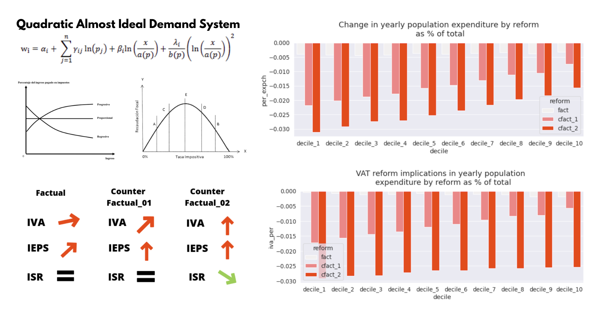
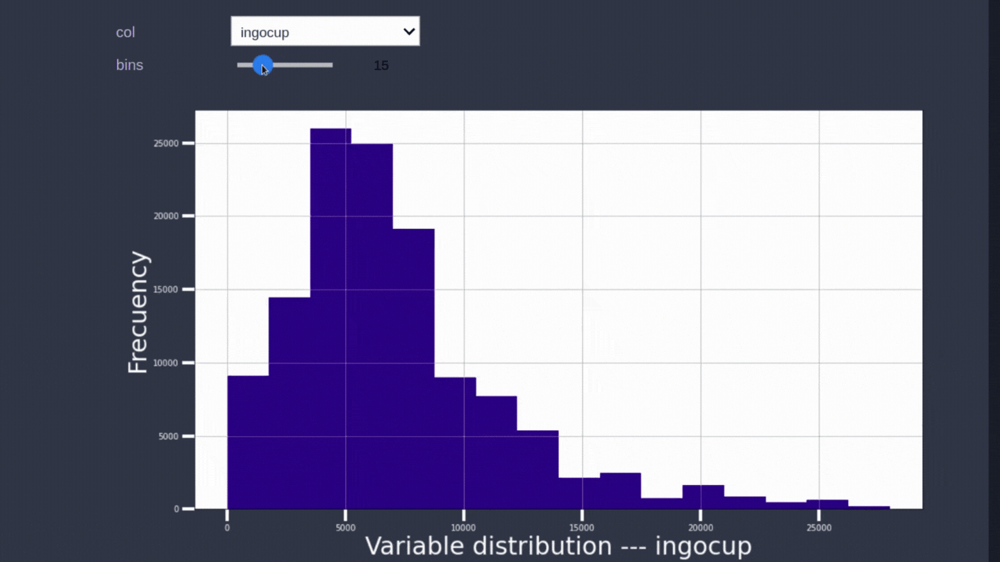

# Portfolio
---
## Projects
---
### Counterfactual analysis with microsimulation models
#### 📅 Feb 2018 - Abr 2019
#### Handling data - adapting code - microsimulation models - stata

We adapted a STATA microsimulation model called LATAX developed for Laura Abramovsky a research associate of the Institute for Fiscal Studies (UK), in order to develop a comparison between the 2014 fiscal reform and two own proposals to see the effect on the population expenditure by spending decile. On the other hand, we also observe the behavior of tax revenue.

 
 

---
### Exploratory Data Analysis of the Mexican National Survey of Occupation and Employment
#### 📅 March 2020
#### Handling - plotting interactive - plotting geodata - python libraries

---
### Build and exploring panel data for the study of payroll tax in Mexico
#### 📅 Abr 2022
#### Panel data - tax competition - python - streamlit

I had the chance to collaborate in a research-oriented to study a virtual tax competition between Mexican states (in the process). In this work, I contribute in two ways, first search and handle the data, and deploy an interactive app in order to show the exploratory data analysis friendly.

---

## Support of legislative task
---

I worked as a chief office assistant of the local congress lady Malú Berver in the LIX Legislature of Colima (2018 – 2021), this gave me the chance to collaborate in the development of different law proposals, in the following links you can see some of them.

#### Center for the study of public fianaces of the Colima's Congress

 Objetive: The center for the study of public finances of the Colima’s Congress will be created as a support area capable to advise legislative commissions; make forecasting and analyzing public finances; endowing with request information on public finances to legislative commissions and parliamentary groups; advice about financial congress issues. In other words, the Center has the mission to endeavor Colima’s public finance behavior.

Status: Wating for analysis

#### Leggislative sesions efficency and parlamentary gazette

Status: In order to promote transparency, access to information, and effective time management in parliamentary sessions, we encourage the electronic publication of the congress sentences on time (24 hours before of the session starts).

Status: Published in the official government daily “El Estado de Colima”

#### Promoting the combat against overweight and obesity

Diseases associated with overweight and obesity have multiple consequences, some related to life quality and others related to productivity. According to the health and nutrition national survey, in Mexico 72.5% of the population older than 20 years suffer from overweight or obesity, in 2017, six of the ten principal death causes in Mexico were related to overweight and obesity. Promoting effective combat against overweight or obesity have two main benefits, on one hand, we can wait for an increase in expectation and quality of life, on the other hand, it is reasonable to hope for an increase in work productivity () and a virtual lowest expenditure related to the treatment of obesity diseases.

Status: Published in the official government daily “El Estado de Colima”

## Courses
---
#### Advanced Management Training - 2022

#### Time Series Analysis and Forecasting - 2021

#### Machine Learning and data science - 2021

#### La nueva Economía Digital en América Látina y el Caribe - 2018
[] (https://courses.edx.org/certificates/f28ab7f5c2144ffe8c536a5f8c7415a9)

#### Realidad Social Latinoamericana - 2017

#### In process 

#### Business Inteligence - 2022

#### Web Scrapping - 2022

#### Python Master Course - 2022

--- 
## Akwards 🏆

#### Local University League of Football Indoor - 2017

#### State University League of Football Indoor - 2017

#### Impulsa Indajo of the Colima's Town Hall: Better business idea - 2018

#### Thesis honorific mention - 2019

